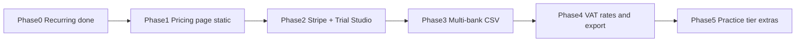

# Plan: Feature gaps, subscriptions, and public pricing

**Status:** Planning document (not yet implemented)  
**Date:** 18 September 2026  
**Inputs:** [Competitor research](../competitor-research.md), current product (recurring invoices UI shipped), README “What’s next”

This plan covers three workstreams that should ship as a coherent go-to-market slice:

1. **Product gaps** that matter for the UK consultancy/studio ICP
2. **Subscriptions and tiers** (billing + entitlements)
3. **Public pricing page** (marketing)

Do **not** chase Xero parity (payroll, multi-currency, 1,000 apps, full MTD filing). Stay the weekly ops layer.

---

## Goals

- Close the remaining high-value gaps so paid plans feel complete for non-VAT or lightly VAT-registered service firms.
- Charge money with a clear, honest price under FreeAgent Ltd / Xero Grow.
- Publish a `/pricing` page that matches the product story (spreadsheet replacement, quote → order → invoice).

## Non-goals

- Full HMRC MTD VAT/ITSA filing in this programme.
- Live Open Banking as a hard dependency for v1 paid launch (CSV-first remains primary).
- Per-seat pricing, contracts/e-sign, time tracking, accountant partner channel build-out.

---

## Workstream A — Feature gaps

Ordered by ICP impact from the research. Recurring invoices UI is **done** and out of scope here.

### A1. Multi-bank CSV import (**done**)

**Why:** Research ranked “live feed or multi-bank CSV beyond Starling” as the #2 gap. Schema already has `bank_provider` and `csv_mapping` (`[drizzle/0028_multi_bank_csv_import.sql](../drizzle/0028_multi_bank_csv_import.sql)`).

**Shipped:**

- Detect/map CSV formats for Starling, Monzo, Tide, Revolut Business, Wise, high-street banks, plus a generic column-mapper fallback.
- Settings UX: choose bank provider; presets show expected columns; Other saves mapping on first import.
- Import flow: provider-specific help; fingerprint mismatch → detect another preset or open mapper (no hard error); de-dupe + match-to-invoice/expense unchanged.
- Tests: fixture CSVs under `tests/fixtures/bank/`.

**Explicitly later (A1b):** True Open Banking / live feed behind a higher tier once CSV coverage is trusted.

### A2. VAT readiness without full MTD (**done**)

**Why:** VAT-registered studios currently bounce to Xero/FreeAgent. A bridging path unblocks them without becoming a tax product.

**Shipped:**

- Company setting: VAT registered, VAT number, default rate (0 / 20 / custom).
- Invoice/quote/order/recurring/expense: selectable VAT rate; unregistered forces 0%.
- Reports: real VAT summary (output/input/net) + Download VAT CSV; P&L ex-VAT; accountant pack `vat.csv` + optional `vat.pdf`.
- Recurring templates: inherit VAT on line template.

**Explicitly later (A2b):** MTD-compatible filing APIs. Plan-gated VAT export (Workstream B).

### A3. Quote / invoice client polish (Bonsai cues) (**done**)

**Why:** Steal presentation quality, not contracts.

**Shipped:**

- Public quote page `/q/{token}`: accept/decline, viewed tracking, PDF download; email CTAs; staff Sent/Viewed/Accepted timestamps.
- Invoice PDF v2 + quote PDF: Subtotal / VAT / Total when VAT applies; VAT number in footer.

### A4. Out of scope for this programme

- Time tracking, contracts/e-sign, payroll, multi-currency books, mobile apps.

---

## Workstream B — Subscriptions and tiers

### Pricing model (locked defaults)

From competitor research hypothesis, refined to publishable numbers:

| Plan           | Price (ex VAT) | Billing                       | Who                                               |
| -------------- | -------------- | ----------------------------- | ------------------------------------------------- |
| **Trial**      | £0             | 30 days                       | New orgs after onboarding                         |
| **Essentials** | £19 / org / mo | Monthly or annual (−2 months) | Default paid plan for 1–3 person firms            |
| **Premium**    | £29 / org / mo | Monthly or annual (−2 months) | Higher limits + earlier access to bank/VAT extras |

**Principles:**

- **Per organisation, not per seat** (avoid Bonsai/Harvest seat tax).
- Price sits under FreeAgent Ltd (£33) and Xero Grow (£39).
- Market as “books for the week, not tax filing.”
- Accountant multi-company access remains invite-based; seat count is soft (fair-use), not billed.

### Entitlements (v1)

| Capability                                                                                                    | Trial             | Essentials    | Premium       |
| ------------------------------------------------------------------------------------------------------------- | ----------------- | ------------- | ------------- |
| Core books (clients, quotes, orders, invoices, expenses, reimbursements, dividends, reports, accountant pack) | Yes               | Yes           | Yes           |
| Recurring invoices                                                                                            | Yes               | Yes           | Yes           |
| Users (founders + accountant)                                                                                 | Up to 3           | Up to 3       | Up to 15      |
| Multi-bank CSV providers                                                                                      | All supported     | All supported | All supported |
| VAT rates + VAT export                                                                                        | Summary only / £0 | Yes           | Yes           |
| Live bank feed (when built)                                                                                   | No                | No            | Yes (future)  |
| Priority support / early features                                                                             | No                | No            | Soft flag     |

Adjust numbers in Stripe products; keep a single `entitlements` module in code so UI and API check one place.

### Billing provider

**Stripe** via **Vercel Marketplace payments** (subscriptions, no product catalog).

At implementation time (not in this doc’s authorship):

1. `vercel integration discover --category payments`
2. `vercel integration add` Stripe (or preferred Marketplace payments integration)
3. `vercel env pull` — do **not** hand-roll Stripe keys or mock billing.

### Data model (sketch)

On `companies` (or a dedicated `subscriptions` table keyed by `company_id`):

- `stripe_customer_id`
- `stripe_subscription_id`
- `plan` — `trial` | `studio` | `practice`
- `status` — `trialing` | `active` | `past_due` | `canceled` | `none`
- `trial_ends_at`, `current_period_end`
- `cancel_at_period_end`

Webhook handler: `checkout.session.completed`, `customer.subscription.*`, `invoice.paid` / `invoice.payment_failed`.

### Product UX

- After onboarding: start Trial; banner with days remaining + “Choose a plan.”
- Settings → Billing: current plan, upgrade/downgrade (Stripe Checkout or Customer Portal), invoices from Stripe.
- Soft gate: when trial ends without payment → read-only books + upgrade CTA (do not wipe data).
- Platform admin: view plan/status; ability to grant complimentary Practice.

### Enforcement

Central helper: `requireEntitlement(companyId, feature)` used by server actions (recurring already platform-flagged; migrate to plan entitlements where appropriate). Keep `RECURRING_INVOICES_ENABLED` as a platform kill switch above plan checks.

---

## Workstream C — Public pricing page

### Route and chrome

- New page: `[src/app/pricing/page.tsx](../src/app/pricing/page.tsx)` (public, same shell as home/guides).
- Add **Pricing** to `[PublicHeader](../src/components/marketing/public-header.tsx)` and footer.
- CTAs: “Start free trial” → `/sign-up`; “Sign in” for existing.

### Page content (one composition, brand-first)

Align with marketing rules: not a dashboard of cards; clear brand, one primary offer story.

Suggested sections:

1. **Hero** — Brand + “Books for the week. Price under FreeAgent.” One supporting line. Primary CTA: Start free trial.
2. **Plans** — Trial / Essentials / Premium comparison (honest inclusions; VAT note: “VAT export, not HMRC filing”).
3. **What’s included** — quote → order → invoice, expenses/receipts, bank CSV, accountant pack — not a feature dump vs Xero.
4. **Who it’s for** — UK consultancies, studios, small agencies (Ltd + sole trader).
5. **FAQ** — accountant still files returns; GBP only; CSV not live feed yet; cancel anytime; annual discount.
6. **Final CTA**

Copy must attack **spreadsheets**, not Xero. Mention accountant invite as the answer to “my accountant uses Xero.”

### SEO

Title/description aimed at “UK consultancy invoicing software” / “books for small agency UK” — not head-on “Xero alternative” as H1.

---

## Suggested delivery phases

| Phase | Deliverable                                                                                                      | Depends on           |
| ----- | ---------------------------------------------------------------------------------------------------------------- | -------------------- |
| 0     | Recurring invoices UI                                                                                            | **Done**             |
| 1     | Static `/pricing` with proposed tiers + trial messaging (Checkout CTAs can be “coming soon” or wait for Phase 2) | Copy lock            |
| 2     | Stripe Marketplace install, Checkout, Portal, webhooks, trial→Studio                                             | Phase 1 copy         |
| 3     | Multi-bank CSV (A1)                                                                                              | Stable import UX     |
| 4     | VAT rates + export (A2); unlock on Studio+                                                                       | Phase 2 entitlements |
| 5     | Practice entitlements for higher limits / future live feed flag                                                  | Phase 2–4            |

**Recommended launch cut:** Phase 1–2 + A1 (multi-bank) so paid customers get immediate bank value; VAT export can follow within one sprint if Studio messaging promises it.

---

## Implementation checklist (when executing)

### Pricing page

- [ ] `/pricing` page + header/footer links
- [ ] FAQ + plan comparison matching entitlement table
- [ ] Analytics events on CTA clicks (if already instrumented elsewhere)

### Billing

- [ ] Provision Stripe via Vercel Marketplace; pull env
- [ ] Schema migration for subscription fields
- [ ] `lib/billing/entitlements.ts` + gate critical writes after trial
- [ ] Checkout session create action; Customer Portal link
- [ ] Webhook route (raw body verify) + idempotent updates
- [ ] Settings → Billing UI
- [ ] Platform admin: plan/status + complimentary grant
- [ ] Tests: webhook fixtures; entitlement matrix; trial expiry soft-lock

### Gaps

- [x] Multi-bank CSV adapters + fixtures (A1)
- [x] VAT rate on lines + report/export (A2)
- [x] Public quote accept + PDF VAT (A3)
- [x] Help guide + README “What’s next” updates

### Docs to update on ship

- [x] `[docs/competitor-research.md](../competitor-research.md)` — mark A1–A3 gaps closed
- [ ] `[README.md](../README.md)` — pricing, Stripe env, entitlements (Workstream B)
- [ ] `[docs/SETUP.md](../SETUP.md)` — Marketplace Stripe steps (Workstream B)

---

## Risks

| Risk                                    | Mitigation                                                                                              |
| --------------------------------------- | ------------------------------------------------------------------------------------------------------- |
| Bank-tied FreeAgent/Starling free tiers | Don’t compete on £0; win on milestones + reimbursements + pack                                          |
| Accountant demands Xero                 | Keep invite + pack; never claim “replace Xero”                                                          |
| VAT buyers expect MTD submit            | Pricing/FAQ: export only; accountant still files                                                        |
| Stripe complexity delays launch         | Ship static pricing (Phase 1) then Checkout; soft-lock trial with manual upgrade path only as emergency |
| Over-building Open Banking              | CSV-first; live feed as Practice future flag                                                            |

---

## Success criteria

- Public `/pricing` live with Studio £19 / Practice £29 (ex VAT) and 30-day trial.
- New companies can start trial and convert via Stripe without ops intervention.
- At least two non-Starling bank CSVs import cleanly in production.
- VAT-registered Studio customers can produce a period VAT CSV for their accountant.
- Messaging on pricing and homepage consistently sells spreadsheet replacement + quote → order → invoice.
